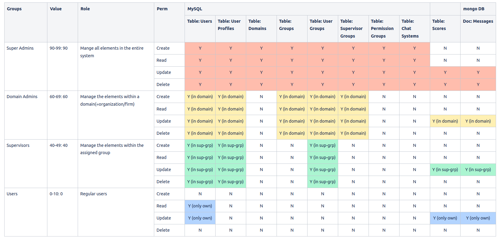

# 課題１ - PHP②-

## ①課題の内容（どんな作品）
- MVPのMVCの部品を引き続き作成。　以下の機能を今週実装した。
    - 各テーブルへのCRUDを定義し、それを実装した。
        - 
    - チャットボットから受け取るメッセージから、依頼、命令、指示に類するメッセージのみを捉えて、ChatGPTにプロンプトできるようにした。
    

## ②工夫した点・こだわった点
- データベースへのCRUDの制御は、全てLaravelのControllerで実装することにチャレンジした。
- チャットのメッセージから、依頼、命令、指示に類するメッセージの判定には、処理速度を重視してMeCabを使って実装した。

## ③難しかった点・次回トライしたいこと(又は機能)
- ControllerによるテーブルへのCRUD制御はほぼ出来たが、Blade上でボタン非表示等を実装したかったが、Contorllerから送った値を、Bladeのコンポーネントに渡す方法が見つからず時間切れとなった。
- メッセージから、依頼、命令、指示を判定させる機能の開発が難しかった。
    - Deep-Learningで作るか、形態素解析で作るか悩んだが、すぐに実装し実験ができる形態素解析を選んだ。
    - MeCabか、janomeのいずれにするか悩んだが、処理速度が速いMeCabで進めることにした。
  
## ④質問・疑問・感想、シェアしたいtips等なんでも
[質問]
- 

[疑問]　
- 

[感想]　
  -
[tips]　
  - 
[参考記事]
